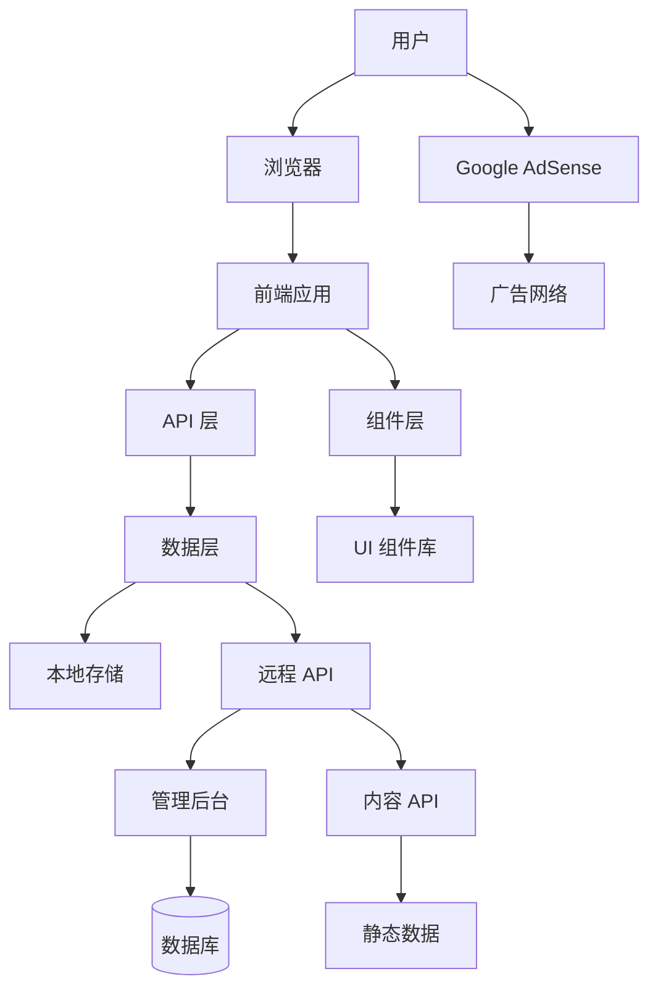
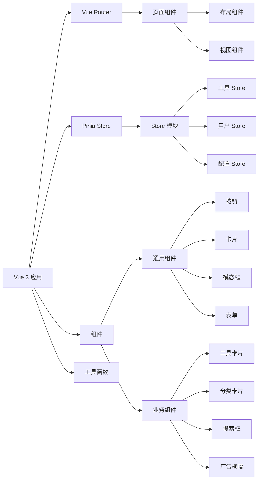

# AI Navigation Site

Feature Name: ai-navigation-site
Updated: 2026-02-11

## Description

AI 导航站是一个集中展示和管理各类 AI 工具的网站平台。该平台提供 AI 工具的分类浏览、搜索、详情展示、用户提交等功能，旨在帮助用户快速发现和访问高质量的 AI 工具和资源。项目采用现代化的技术栈，注重工程化架构、代码质量和用户体验，同时支持 Google AdSense 广告收益模式。

本设计文档基于用户需求讨论，融合了开源项目的优秀实践，采用模块化、组件化的工程化架构。

## Architecture

### 系统架构



### 前端架构



### 目录结构

```
ai-navigation-site/
├── public/                    # 静态资源
│   ├── images/               # 图片资源
│   ├── icons/                # 图标资源
│   └── ads/                  # 广告配置
├── src/
│   ├── assets/               # 资源文件
│   │   ├── styles/          # 全局样式
│   │   └── constants/       # 常量定义
│   ├── components/           # 可复用组件
│   │   ├── common/          # 通用组件
│   │   │   ├── Button.vue
│   │   │   ├── Card.vue
│   │   │   ├── Modal.vue
│   │   │   └── Form.vue
│   │   ├── business/        # 业务组件
│   │   │   ├── ToolCard.vue
│   │   │   ├── CategoryCard.vue
│   │   │   ├── SearchBox.vue
│   │   │   ├── AdBanner.vue
│   │   │   └── ThemeToggle.vue
│   │   └── layout/          # 布局组件
│   │       ├── Header.vue
│   │       ├── Footer.vue
│   │       └── Sidebar.vue
│   ├── views/                # 页面组件
│   │   ├── Home.vue         # 首页
│   │   ├── Category.vue     # 分类页
│   │   ├── ToolDetail.vue   # 工具详情
│   │   ├── Search.vue       # 搜索页
│   │   ├── Submit.vue       # 提交工具
│   │   ├── Favorites.vue    # 收藏页
│   │   ├── Compare.vue      # 对比页
│   │   └── About.vue        # 关于页
│   ├── router/               # 路由配置
│   │   └── index.ts
│   ├── stores/               # 状态管理
│   │   ├── tool.ts          # 工具状态
│   │   ├── user.ts          # 用户状态
│   │   ├── config.ts        # 配置状态
│   │   └── favorites.ts     # 收藏状态
│   ├── api/                  # API 封装
│   │   ├── tools.ts         # 工具 API
│   │   ├── categories.ts    # 分类 API
│   │   └── submit.ts        # 提交 API
│   ├── utils/                # 工具函数
│   │   ├── storage.ts       # 本地存储
│   │   ├── format.ts        # 格式化
│   │   ├── validation.ts    # 验证
│   │   └── seo.ts           # SEO 工具
│   ├── types/                # TypeScript 类型
│   │   ├── tool.ts          # 工具类型
│   │   ├── category.ts      # 分类类型
│   │   └── common.ts        # 通用类型
│   ├── composables/          # 组合式函数
│   │   ├── useTheme.ts      # 主题切换
│   │   ├── useFavorites.ts  # 收藏管理
│   │   ├── useSearch.ts     # 搜索功能
│   │   └── useRecommend.ts  # 推荐算法
│   ├── App.vue              # 根组件
│   └── main.ts              # 入口文件
├── data/                     # 数据文件（初始数据）
│   ├── tools.json           # 工具数据
│   ├── categories.json      # 分类数据
│   └── reviews.json         # 评测数据
├── config/                   # 配置文件
│   ├── vite.config.ts       # Vite 配置
│   ├── tailwind.config.ts   # Tailwind 配置
│   └── tsconfig.json        # TypeScript 配置
├── .eslintrc.cjs            # ESLint 配置
├── .prettierrc              # Prettier 配置
├── package.json             # 项目依赖
└── README.md                # 项目说明
```

## Components and Interfaces

### 核心组件

#### 1. ToolCard（工具卡片）

**Props:**
```typescript
interface ToolCardProps {
  tool: Tool;
  showFavorite?: boolean;
  showCompare?: boolean;
}
```

**Events:**
```typescript
interface ToolCardEmits {
  (e: 'click', tool: Tool): void;
  (e: 'favorite', tool: Tool): void;
  (e: 'compare', tool: Tool): void;
}
```

**功能:**
- 展示工具图标、名称、描述、标签
- 收藏按钮
- 加入对比按钮
- 点击跳转详情页

#### 2. SearchBox（搜索框）

**Props:**
```typescript
interface SearchBoxProps {
  placeholder?: string;
  autoFocus?: boolean;
}
```

**Events:**
```typescript
interface SearchBoxEmits {
  (e: 'search', query: string): void;
  (e: 'suggestion-click', tool: Tool): void;
}
```

**功能:**
- 实时搜索建议
- 历史搜索记录
- 热门搜索推荐

#### 3. AdBanner（广告横幅）

**Props:**
```typescript
interface AdBannerProps {
  adUnitId: string;
  size: 'leaderboard' | 'banner' | 'rectangle' | 'skyscraper';
  slot?: string;
}
```

**功能:**
- Google AdSense 广告展示
- 响应式尺寸
- 广告加载状态处理

#### 4. ThemeToggle（主题切换）

**Props:**
```typescript
interface ThemeToggleProps {
  position?: 'header' | 'floating';
}
```

**功能:**
- 亮色/暗色模式切换
- 主题偏好持久化
- 平滑过渡动画

### API 接口

#### 工具 API

```typescript
interface ToolsAPI {
  // 获取工具列表
  getTools(params: {
    category?: string;
    page?: number;
    limit?: number;
    search?: string;
  }): Promise<Tool[]>;

  // 获取工具详情
  getTool(id: string): Promise<Tool>;

  // 获取热门工具
  getHotTools(limit?: number): Promise<Tool[]>;

  // 获取推荐工具
  getRecommendedTools(userId?: string): Promise<Tool[]>;

  // 获取相似工具
  getSimilarTools(toolId: string): Promise<Tool[]>;
}
```

#### 分类 API

```typescript
interface CategoriesAPI {
  // 获取所有分类
  getCategories(): Promise<Category[]>;

  // 获取分类详情
  getCategory(id: string): Promise<Category>;

  // 获取分类下的工具
  getToolsByCategory(categoryId: string): Promise<Tool[]>;
}
```

#### 提交 API

```typescript
interface SubmitAPI {
  // 提交工具
  submitTool(tool: Omit<Tool, 'id' | 'createdAt' | 'updatedAt'>): Promise<boolean>;

  // 提交评论
  submitComment(comment: Comment): Promise<boolean>;

  // 提交评分
  submitRating(toolId: string, rating: number): Promise<boolean>;
}
```

## Data Models

### Tool（工具）

```typescript
interface Tool {
  id: string;
  name: string;
  slug: string;
  description: string;
  fullDescription?: string;
  icon: string;
  website: string;
  category: string;
  tags: string[];
  pricing: {
    free: boolean;
    plans: Plan[];
  };
  rating: {
    average: number;
    count: number;
  };
  features: string[];
  screenshots?: string[];
  video?: string;
  reviews?: Review[];
  alternatives?: string[];
  createdAt: Date;
  updatedAt: Date;
}

interface Plan {
  name: string;
  price: number;
  currency: string;
  period: string;
  features: string[];
}

interface Review {
  id: string;
  author: string;
  content: string;
  rating: number;
  pros: string[];
  cons: string[];
  createdAt: Date;
}
```

### Category（分类）

```typescript
interface Category {
  id: string;
  name: string;
  slug: string;
  icon: string;
  description: string;
  parentId?: string;
  order: number;
  toolCount: number;
  createdAt: Date;
  updatedAt: Date;
}
```

### Comment（评论）

```typescript
interface Comment {
  id: string;
  toolId: string;
  author: string;
  email?: string;
  content: string;
  rating?: number;
  createdAt: Date;
  updatedAt: Date;
}
```

### User（用户）

```typescript
interface User {
  id: string;
  favorites: string[]; // 工具 ID 列表
  history: string[]; // 浏览历史（工具 ID 列表）
  theme: 'light' | 'dark';
  createdAt: Date;
  updatedAt: Date;
}
```

## Correctness Properties

### 数据一致性

1. **工具数据完整性**：每个工具必须包含 id、name、description、website、category 等必填字段
2. **分类层级正确性**：子分类的 parentId 必须指向有效的父分类
3. **评分计算准确性**：平均评分必须基于所有用户评分的算术平均值
4. **收藏数据同步**：用户收藏列表必须在所有视图间保持一致

### 状态管理

1. **主题切换一致性**：主题状态必须在所有组件间同步
2. **搜索结果准确性**：搜索结果必须匹配用户输入的关键词
3. **推荐算法公平性**：推荐算法不应歧视任何工具
4. **缓存更新及时性**：当数据变更时，缓存必须在合理时间内更新

### 用户体验

1. **页面加载性能**：首屏加载时间不超过 3 秒
2. **交互响应时间**：用户操作响应时间不超过 100ms
3. **错误处理友好性**：所有错误都必须有友好的用户提示
4. **跨设备一致性**：在不同设备上功能和行为必须保持一致

## Error Handling

### 网络错误

1. **API 请求失败**：
   - 显示友好的错误提示
   - 提供重试按钮
   - 记录错误日志

2. **资源加载失败**：
   - 图片加载失败时显示占位图
   - 广告加载失败时不影响页面正常显示
   - 提供刷新选项

### 用户输入错误

1. **表单验证**：
   - 实时验证用户输入
   - 显示具体的错误信息
   - 高亮错误字段

2. **搜索无结果**：
   - 显示友好提示
   - 提供搜索建议
   - 显示热门工具

### 系统错误

1. **500 内部服务器错误**：
   - 显示通用错误页面
   - 提供返回首页按钮
   - 记录详细错误日志

2. **404 页面未找到**：
   - 显示 404 页面
   - 提供相关推荐
   - 提供搜索功能

### 错误监控

1. **前端错误监控**：
   - 使用 Sentry 或类似工具监控前端错误
   - 记录用户行为上下文
   - 及时通知开发团队

2. **性能监控**：
   - 监控页面加载时间
   - 监控 API 响应时间
   - 监控用户交互延迟

## Test Strategy

### 单元测试

1. **组件测试**：
   - 使用 Vitest 测试所有组件
   - 测试组件渲染、Props、Events
   - 测试组件在不同状态下的行为

2. **工具函数测试**：
   - 测试所有工具函数的正确性
   - 测试边界情况
   - 测试错误处理

3. **Store 测试**：
   - 测试状态管理的正确性
   - 测试 Actions 和 Getters
   - 测试状态更新逻辑

### 集成测试

1. **API 集成测试**：
   - 测试 API 请求和响应
   - 测试错误处理
   - 测试数据转换

2. **路由测试**：
   - 测试路由导航
   - 测试路由参数
   - 测试路由守卫

### 端到端测试

1. **用户流程测试**：
   - 测试用户注册/登录流程
   - 测试工具浏览和搜索流程
   - 测试工具提交流程

2. **跨浏览器测试**：
   - 测试主流浏览器（Chrome、Firefox、Safari、Edge）
   - 测试不同版本的兼容性

3. **响应式测试**：
   - 测试桌面端、平板、移动端的显示
   - 测试不同屏幕尺寸的适配

### 性能测试

1. **加载性能测试**：
   - 使用 Lighthouse 测试页面性能
   - 测试首屏加载时间
   - 测试资源加载优化

2. **交互性能测试**：
   - 测试滚动性能
   - 测试动画流畅度
   - 测试大量数据渲染性能

### SEO 测试

1. **Meta 标签测试**：
   - 测试所有页面的 Title 和 Description
   - 测试 Open Graph 标签
   - 测试结构化数据

2. **可访问性测试**：
   - 测试 ARIA 标签
   - 测试键盘导航
   - 测试屏幕阅读器支持

### 测试覆盖率目标

- 单元测试覆盖率 >= 80%
- 集成测试覆盖率 >= 60%
- 端到端测试覆盖关键用户流程

## References

[^1]: (网站) - firekinger/ai-nav-site GitHub 项目 - https://github.com/firekinger/ai-nav-site
[^2]: (网站) - Vue.js 官方文档 - https://vuejs.org/
[^3]: (网站) - Vite 官方文档 - https://vitejs.dev/
[^4]: (网站) - Element Plus 官方文档 - https://element-plus.org/
[^5]: (网站) - Tailwind CSS 官方文档 - https://tailwindcss.com/
[^6]: (网站) - Pinia 官方文档 - https://pinia.vuejs.org/
[^7]: (网站) - Google AdSense 文档 - https://support.google.com/adsense/
[^8]: (文档) - EARS (Easy Approach to Requirements Syntax) - 国际需求工程标准
[^9]: (文档) - INCOSE 需求语义质量规则 - 国际系统工程委员会
[^10]: (用户对话) - 2026-02-11 AI 导航站项目讨论记录
